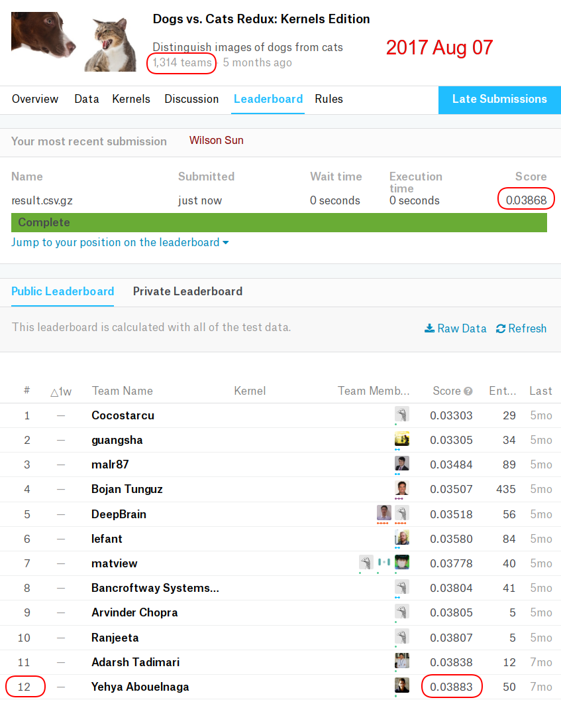

# Kaggle Competitions

I participate in interesting Kaggle competitions from time to time. My primary goal is to develop my understanding of machine learning. I participate in both current and past competitions. When a current competition I participate ends, I continute to research ways to improve performance.

This repo summarizes a few competitions that I have participated.

## [Dogs vs. Cats Redux: Kernels Edition](https://www.kaggle.com/c/dogs-vs-cats-redux-kernels-edition)

### My Status

* My Official Rank: # 128 (Top 10%) with 98.5% accuracy
* My Late Submission Rank: # 12 (Top 1%) with 99.8% accuracy

### Competition Overview

The task is to distinguish images of dogs from cats. To elaborate, we want to train a deep
neural network to tell whether any given image is a dog or a cat, assuming that the input image is
always either a dog or a cat, but not both at the same time. Further details are explained in the
competition homepage.

### My Story with This Competition

This was my first encounter with deep learing using GPU.

I first participated in this competition when taking an [online course](http://course.fast.ai/index.html) taught by Jeremy Howard, former president of Kaggle. In that course, Jeremy taught how to fine-tune the VGG-16 model to solve this problem. In the homework, he has asked us to get into top 50% of the competition. Back then, the competition was still open to submissions, and I have tried hard to score high on the leaderboard. I have mainly followed Jeremy's teaching, but added a little bit of my own creativity as well. After 23 submissions, I have finally ranked No. 128 out of 1314 teams (__Top 10%__). Guess what? __Jeremy was immediately below me on the leaderboard__, ranked No. 129. I felt excited and surprised, and motivated to learn more about machine learning.

After the competition deadline has passed, I tackled the problem again as my capstone project for Udacity's [Machine Learning Nanodegree program](https://www.udacity.com/course/machine-learning-engineer-nanodegree--nd009). Thanks to the new knowledge I learned from the program, I have improved my unofficial late submission rank to __Top 2%__. For details, please kindly refer to the [project report](dogs_vs_cats_report.pdf).

Everytime I learn some new technique or idea, I try it out on this problem. My newest late submission score ranks __Top 1%__.

## [Invasive Species Monitoring](https://www.kaggle.com/c/invasive-species-monitoring)

### My Status

* My Official Rank: # 38 (Top 8%) with 99.3% accuracy as part of team "UBC 666"

### Competition Overview

The task is to determine whether an image contains a certain type of flower that is considered an invasive specie in Georgia.

### My Story with This Competition

* Applied transfer learning, ensemble learning, and data augmentation.
* Retrained VGG-16, ResNet-50, and Inception-V3 to increase accuracy for this specific task.

